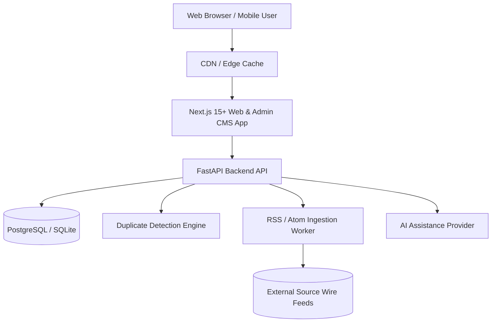

# Daily Discovery: System Architecture

Daily Discovery is a modular, high-scale content and utility platform combining verified regional (Cambodia) and international news with visual educational discoveries, daily quizzes, and client-side online tools.

---

## 1. High-Level Monorepo Topology

### Components:
1. **`apps/web`**: Next.js 15+ App Router, React 19, TypeScript, Tailwind CSS, Lucide Icons.
   - Server-Side Rendered (SSR) & Incremental Static Regeneration (ISR) for public news and discovery pages.
   - Client-side interactive islands for quizzes, calculators, developer utilities, and image compressors.
   - Dedicated protected Admin CMS interface at `/admin`.
   - AdSlot abstraction with `AdProvider` (initially dormant; zero layout shift).
2. **`apps/api`**: Python FastAPI backend.
   - Layered architecture: `api/v1` routers, `domain` entities, `models` (SQLAlchemy), `schemas` (Pydantic), `services`.
   - Unicode-safe database layer with foreign keys, indexes, and full audit trails.
   - Duplicate detection engine with title normalization, Jaccard/Levenshtein matching, and event clustering.
   - AI provider abstraction (`LocalAIProvider`, `OpenAI`, `Anthropic`, `Gemini`) with human-in-the-loop guarantee.
3. **`database/`**:
   - Schema definitions, migrations, and realistic seed data.

---

## 2. Scalability Roadmap (10k -> 1M Users)

- **Stateless API**: FastAPI runs asynchronously with Uvicorn workers behind a reverse proxy (Nginx or Caddy).
- **Edge Caching**: Public article pages, sitemaps, and RSS feeds are cached at the CDN layer with 60-second revalidation windows.
- **Client-Side Compute**: Utilities (calculators, image compression, QR generation) execute entirely in the user's browser, eliminating CPU load from the backend.
- **Database Optimization**: B-Tree indexes on `slug`, `published_at`, `trend_score`, `category_id`, and `country`.
